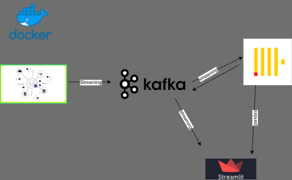

# 🚀 streaming_etl

A comprehensive real-time ETL (Extract, Transform, Load) pipeline built with Docker, Kafka, Pandas, Click_house, and Streamlit. This system processes streaming data in real-time, transforms it using Pandas, stores it in DuckDB for fast analytical queries, and provides a real-time dashboard using Streamlit.

## 🏗️ Architecture

```
┌─────────────────┐    ┌─────────────────┐    ┌─────────────────┐    ┌─────────────────┐
│   Data Sources  │───▶│     Kafka      │───▶│   ETL Service   │───▶│    click_house │
│                 │    │                 │    │                 │    │                 │
└─────────────────┘    └─────────────────┘    └─────────────────┘    └─────────────────┘
                                │                                              │
                                ▼                                              ▼
                       ┌─────────────────┐      ───▶              ┌─────────────────┐
                       │  Data Generator │                        │ Streamlit App   │
                       │   (Testing)     │                        │  (Dashboard)    │
                       └─────────────────┘                        └─────────────────┘
```


## 🚀 Features

- **Real-time Data Processing**: Kafka-based streaming with sub-second latency
- **Data Transformation**: Pandas-powered data cleaning and enrichment
- **Fast Analytics**: ClickHouse for high-performance analytical queries
- **Real-time Dashboard**: Streamlit-based interactive visualizations
- **Containerized**: Docker-based deployment for easy setup and scaling
- **Data Validation**: Built-in data quality checks and error handling
- **Monitoring**: Real-time processing metrics and performance tracking

## 📋 Prerequisites

- Docker and Docker Compose
- Python 3.11+ (for local development)
- At least 4GB RAM available for containers

## 🛠️ Installation & Setup

### 1. Clone the Repository

```bash
git clone <repository-url>
cd kafka_etl
```

### 2. Create Data Directory

```bash
mkdir data
```

### 3. Start the Pipeline

```bash
docker-compose up -d
```

This will start:
- **ClickHouse** (port 9181)
- **Kafka** (port 9092)
- **ETL Service** (port 8000)
- **Streamlit Dashboard** (port 8501)

### 4. Verify Services

```bash
docker-compose ps
```

## 🎯 Usage

### Access the Dashboard

Open your browser and navigate to: http://localhost:8501

### Generate Test Data

The system includes a data generator for testing:

```bash
# Generate 20 sample records
docker-compose exec etl-service python data_generator.py --count 20

# Run continuous data generation
docker-compose exec etl-service python data_generator.py --mode continuous --interval 10
```

### Monitor the Pipeline

- **Kafka Topics**: Monitor message flow in real-time
- **Processing Logs**: View ETL service logs
- **Database**: Query DuckDB directly for data analysis

## 📊 Data Flow

### 1. Data Ingestion
- Raw data streams into Kafka topics (`user-events`, `metrics`)
- Data generator creates sample events and metrics

### 2. Data Processing
- ETL service consumes messages from Kafka
- Pandas processes and transforms the data
- Data validation and enrichment applied

### 3. Data Storage
- Processed data stored in ClickHouse tables
- Optimized for analytical queries
- Real-time updates

### 4. Data Visualization
- Streamlit dashboard displays real-time metrics
- Interactive charts and tables
- Auto-refresh capabilities

## 🗄️ Database Schema

### User Events Table
```sql
CREATE TABLE user_events (
    id INTEGER PRIMARY KEY,
    user_id VARCHAR,
    event_type VARCHAR,
    timestamp TIMESTAMP,
    data JSON,
    processed_at TIMESTAMP DEFAULT CURRENT_TIMESTAMP
);
```

### Metrics Table
```sql
CREATE TABLE metrics (
    id INTEGER PRIMARY KEY,
    metric_name VARCHAR,
    metric_value DOUBLE,
    timestamp TIMESTAMP,
    processed_at TIMESTAMP DEFAULT CURRENT_TIMESTAMP
);
```

### Processing Stats Table
```sql
CREATE TABLE processed_data (
    id INTEGER PRIMARY KEY,
    source_topic VARCHAR,
    record_count INTEGER,
    processing_time_ms DOUBLE,
    timestamp TIMESTAMP,
    processed_at TIMESTAMP DEFAULT CURRENT_TIMESTAMP
);
```

## 🔧 Configuration

### Environment Variables

- `KAFKA_BOOTSTRAP_SERVERS`: Kafka broker addresses
- `DATA_PATH`: Path to ClickHouse database file
- `KAFKA_TOPICS`: Comma-separated list of topics to consume

### Kafka Topics

- `user-events`: User interaction events
- `metrics`: System and application metrics
- `processed-data`: Output of ETL processing

## 📈 Monitoring & Metrics

### Real-time Metrics
- Processing latency
- Throughput (records/second)
- Error rates
- Data quality metrics

### Dashboard Features
- Live metric cards
- Time-series charts
- Event distribution analysis
- Processing statistics

## 🚨 Troubleshooting

### Common Issues

1. **Kafka Connection Failed**
   - Ensure Kraft Mode is Set
   - Check Kafka container logs
   - Verify network connectivity

2. **Database Connection Issues**
   - Check all Clickhouse Config files
   - Ensure data directory exists
   - Verify container volumes

3. **Dashboard Not Loading**
   - Check Streamlit container status
   - Verify port 8501 is accessible
   - Check application logs

### Logs

```bash
# View ETL service logs
docker-compose logs etl-service

# View Streamlit logs
docker-compose logs streamlit-app

# View Kafka logs
docker-compose logs kafka
```

## 🔄 Scaling

### Horizontal Scaling
- Add multiple ETL service instances
- Use Kafka consumer groups for load balancing
- Scale Streamlit instances behind a load balancer

### Performance Tuning
- Adjust Kafka partition counts
- Optimize ClickHouse query performance
- Tune Pandas processing parameters

## 🧪 Testing

### Unit Tests
```bash
docker-compose exec etl-service python -m pytest tests/
```

### Integration Tests
```bash
# Test data flow
docker-compose exec etl-service python test_pipeline.py
```

### Load Testing
```bash
# Generate high-volume test data
docker-compose exec etl-service python data_generator.py --count 10000
```

## 📚 API Reference

### ETL Service Endpoints

- `GET /health`: Service health check
- `GET /metrics`: Processing metrics
- `POST /data`: Manual data injection

### Streamlit Dashboard

- Real-time data visualization
- Interactive filtering and sorting
- Export capabilities
- Custom chart configurations

## 🤝 Contributing

1. Fork the repository
2. Create a feature branch
3. Make your changes
4. Add tests
5. Submit a pull request

## 📄 License

MIT License

Copyright (c) 2025  NarioU-sys

Permission is hereby granted, free of charge, to any person obtaining a copy
of this software and associated documentation files (the "Software"), to deal
in the Software without restriction, including without limitation the rights
to use, copy, modify, merge, publish, distribute, sublicense, and/or sell
copies of the Software, and to permit persons to whom the Software is
furnished to do so, subject to the following conditions:

The above copyright notice and this permission notice shall be included in all
copies or substantial portions of the Software.

THE SOFTWARE IS PROVIDED "AS IS", WITHOUT WARRANTY OF ANY KIND, EXPRESS OR
IMPLIED, INCLUDING BUT NOT LIMITED TO THE WARRANTIES OF MERCHANTABILITY,
FITNESS FOR A PARTICULAR PURPOSE AND NONINFRINGEMENT. IN NO EVENT SHALL THE
AUTHORS OR COPYRIGHT HOLDERS BE LIABLE FOR ANY CLAIM, DAMAGES OR OTHER
LIABILITY, WHETHER IN AN ACTION OF CONTRACT, TORT OR OTHERWISE, ARISING FROM,
OUT OF OR IN CONNECTION WITH THE SOFTWARE OR THE USE OR OTHER DEALINGS IN THE
SOFTWARE.

## 🙏 Acknowledgments

- Apache Kafka for streaming platform
- ClickHouse for analytical database
- Streamlit for dashboard framework
- Pandas for data processing
- Docker for containerization

## 📞 Support

For questions and support:
- Create an issue in the repository
- Check the troubleshooting section
- Review the logs for error details

---

**Happy Streaming! 🎉**


